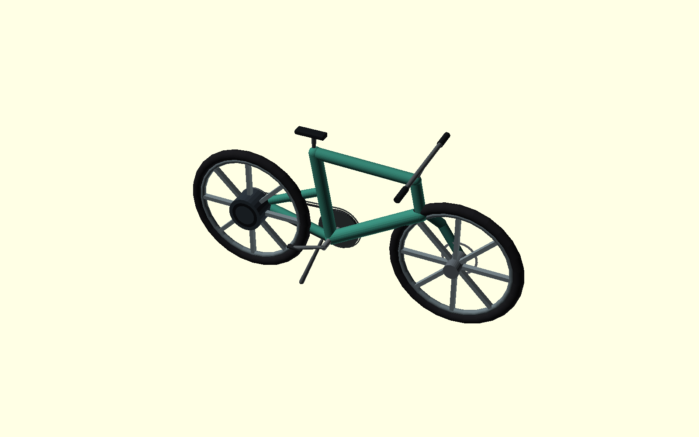

# Sustainable Bike

Parametric OpenSCAD research model for a low-maintenance bicycle built around:

- one front chainring;
- no derailleur and no manual shifter;
- an aramid-reinforced synchronous belt rather than a lubricated metal chain;
- automatic internal rear ratios inside the rear hub envelope;
- a small rear-hub pedal-assist motor;
- single-sided front and rear monoblades with internally retained, tamper-covered hub cartridges;
- solid or airless tire geometry; and
- design-for-disassembly, standard bearings, serviceable electronics, and a material passport.



## Important boundary

**This repository produces a research-scale model and fit-check geometry, not a ride-ready bicycle.** A rotating wheel cannot literally be the same rigid print as the frame. The model therefore makes each wheel *mechanically captive* in a single-sided hub cartridge while keeping the bearing interface able to rotate. Ordinary FDM prints, printed axles, unqualified batteries, or untested structural joints must not be used for a human-carrying bicycle.

The default configuration renders at 16% scale. A full-scale structure requires professional mechanical review, finite-element analysis correlated to physical coupons, fatigue and impact testing, qualified metal or continuous-fiber load paths, brake validation, battery-system certification, and applicable bicycle/e-bike compliance testing.

## Design snapshot

| Subsystem | Reference configuration |
|---|---|
| Wheels | 26 × 2.0 in envelope, solid tire by default; optional airless lattice visualization |
| Retention | Single-sided monoblades, stepped axle, internal fastener, locked tamper cover; no quick release |
| Human drive | 60T front / 22T rear, 11 mm pitch, 12 mm belt, one front ring |
| Gearing | Automatic internal ratios 1.00 and 1.36; no rider-operated shifter |
| Assist | Rear hub, 250 W rated / 500 W peak reference envelope, torque-sensor pedal assist, no throttle |
| Target speed | 25 mph configurable research target; jurisdiction-specific review required |
| Battery | 48 V, 360 Wh locked but serviceable downtube cartridge |
| Brakes | Two independent hand controls, 180 mm front/rear rotor envelopes |

At 85 rpm cadence, the reference 60/22 belt ratio yields about 17.9 mph in the 1.00 internal ratio and 24.4 mph in the 1.36 ratio. The motor controller can bridge starts and small hills while tapering assistance at the configured cutoff.

## Run it

Requirements: Node.js 22+ and OpenSCAD 2021.01 or newer.

```bash
npm test
npm run validate
npm run render:preview
npm run render
```

Outputs are written to `build/`; the checked-in image is `assets/preview.png`.

Select an individual CAD target:

```bash
openscad \
  -o build/front-wheel.stl \
  -D 'PART="front_wheel"' \
  -D 'RENDER_SCALE=0.16' \
  cad/sustainable_bike.scad
```

Available targets: `assembly`, `frame`, `front_fork`, `front_wheel`, `rear_wheel`, `drivetrain`, `rear_hub_cutaway`, `frame_coupon`, and `tire_coupon`.

## Repository map

- `config/bike.json` — authoritative product geometry and constraints.
- `src/calculations.mjs` — gearing, wheel-speed, belt-length, and invariant calculations.
- `cad/sustainable_bike.scad` — main part router and assembly.
- `cad/lib/` — frame, wheel, drivetrain, and component modules.
- `scripts/` — config generation, validation, and rendering.
- `tests/` — deterministic design-calculation tests.
- `docs/` — architecture, safety case, manufacturing sequence, regulatory notes, and material passport.

## Why a belt, not a Kevlar “chain”

A fiber rope or chain-shaped print cannot reliably engage bicycle sprockets or preserve pitch under torque. This design interprets the requirement as a toothed polyurethane synchronous belt with supplier-qualified aramid tensile cords. It is dry-running and needs no oil. Commercial carbon-cord bicycle belts are a mature alternative; final aramid selection still needs fatigue, tooth-shear, environmental, and tension qualification.

## Safety and certification sources

The design-control plan tracks current bicycle and e-bike references including CPSC 16 CFR Part 1512 guidance, ISO 4210-2:2023, ISO/TS 4210-10:2020, UL 2849 electrical-system evaluation, and UL 2271 battery evaluation. See `docs/regulatory.md` and `docs/safety-case.md`.

## License

MIT. Safety-critical manufacture and sale remain the responsibility of the implementing organization and its qualified reviewers.
